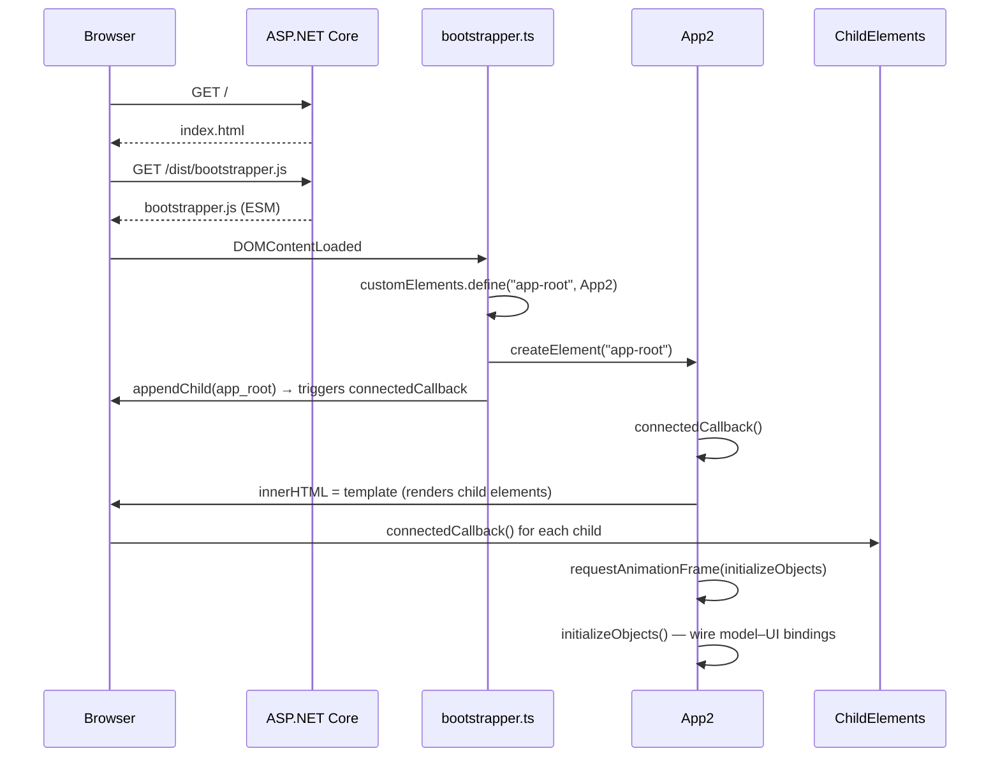

# Architecture

## Overview

TaskManager is a hybrid application combining an ASP.NET Core 8 backend with a Vanilla TypeScript frontend built on the Web Components standard. No frontend framework is used — components are native custom elements.

```
Browser
  └── index.html
        └── bootstrapper.js (ESM entry point)
              └── <app-root>  (App2 custom element)
                    ├── <minimal-ui>
                    ├── <minimal-ui2>
                    └── <counter2-ui>

Server (ASP.NET Core 8)
  └── Program.cs
        ├── UseDefaultFiles()  → serves index.html
        └── UseStaticFiles()   → serves wwwroot/
```

## Layers

### Backend
ASP.NET Core 8 minimal API. Currently acts as a static file host only. Future API routes will be added in `Program.cs`.

### Frontend
Pure TypeScript compiled to ESM modules by esbuild. Two logical layers:

- **Models** — domain logic classes (`Counter`, `Task`, `Tasklist`). Extend `EventEmitter` and emit typed `CustomEvent<T>` when state changes.
- **UI Components** — custom elements (`*-ui.ts`) that extend `HTMLElement` directly, render via `innerHTML`, and react to model events.

## Application Startup

1. ASP.NET Core serves `wwwroot/index.html`
2. `index.html` loads `dist/bootstrapper.js` as an ES module
3. `bootstrapper.ts` registers `App2` as the `<app-root>` custom element and appends it to `#bootstrapper`
4. `App2.connectedCallback()` renders child custom elements via `innerHTML`
5. After the next animation frame, `initializeObjects()` wires up model–UI bindings



## Key Design Decisions

- **No shadow DOM** — components use the regular DOM for simplicity
- **No framework** — the goal is to learn the platform directly
- **Event-driven model updates** — models never reference UI; UI listens to model events
- **ESM modules** — all imports use `.js` extensions (required for native ESM)
