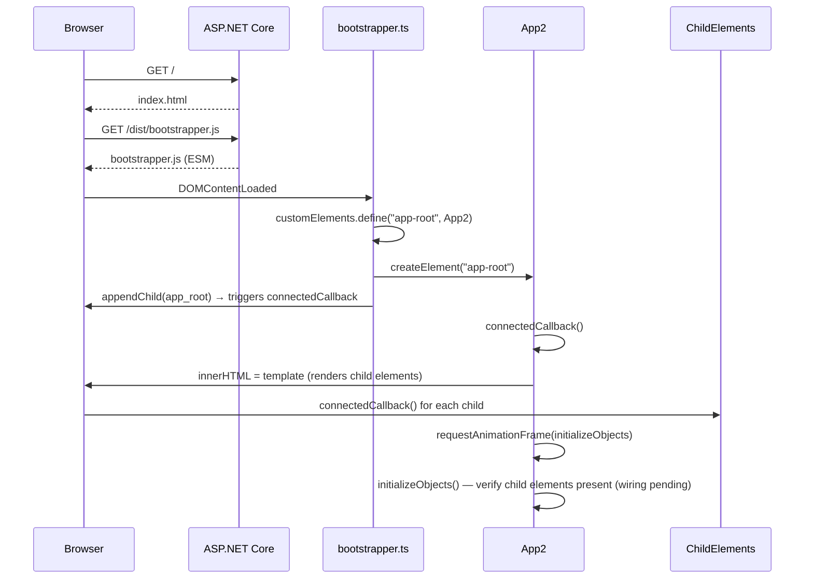
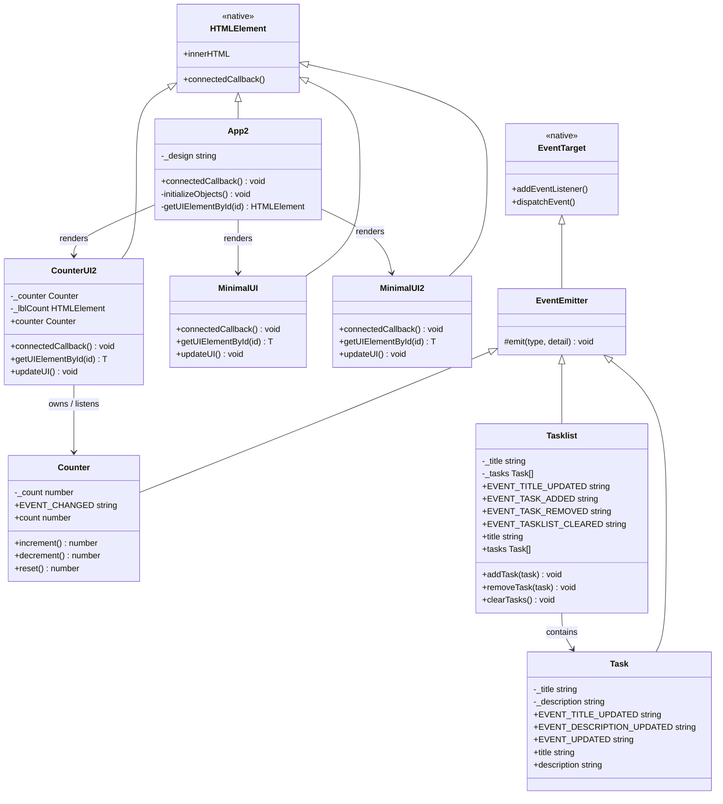

# Architecture

## Overview

TaskManager is a hybrid application combining an ASP.NET Core 8 backend with a Vanilla TypeScript frontend built on the Web Components standard. No frontend framework is used — components are native custom elements.

```
Browser
  └── index.html
        └── bootstrapper.js (ESM entry point)
              └── <app-root>  (App2 custom element)
                    ├── <minimal-ui>
                    ├── <minimal-ui2>
                    └── <counter2-ui>

Server (ASP.NET Core 8)
  └── Program.cs
        ├── UseDefaultFiles()  → serves index.html
        └── UseStaticFiles()   → serves wwwroot/
```

## Layers

### Backend
ASP.NET Core 8 minimal API. Currently acts as a static file host only. Future API routes will be added in `Program.cs`.

### Frontend
Pure TypeScript compiled to ESM modules by esbuild. Two logical layers:

- **Models** — domain logic classes (`Counter`, `Task`, `Tasklist`). Extend `EventEmitter` and emit typed `CustomEvent<T>` when state changes.
- **UI Components** — custom elements (`*-ui.ts`) that extend `HTMLElement` directly, render via `innerHTML`, and react to model events.

## Application Startup

1. ASP.NET Core serves `wwwroot/index.html`
2. `index.html` loads `dist/bootstrapper.js` as an ES module
3. `bootstrapper.ts` registers `App2` as the `<app-root>` custom element and appends it to `#bootstrapper`
4. `App2.connectedCallback()` renders child custom elements via `innerHTML`
5. After the next animation frame, `initializeObjects()` verifies child elements are present

> **Note:** Model creation and model–UI wiring in `initializeObjects()` are currently commented out. The method logs found/not-found messages to the console as a readiness check. Wiring will be added as each UI component matures.



## Component & Model Overview



## Key Design Decisions

- **No shadow DOM** — components use the regular DOM for simplicity
- **No framework** — the goal is to learn the platform directly
- **Event-driven model updates** — models never reference UI; UI listens to model events
- **ESM modules** — all imports use `.js` extensions (required for native ESM)
- **Guard-checked registration** — child custom elements are registered with `!customElements.get(name)` guards in `app2.ts` to prevent double-registration errors
- **Direct HTMLElement subclassing** — active components extend `HTMLElement` directly rather than a `BaseUI` base class, keeping the implementation simple and dependency-free. See [Code Migration](#code-migration) below.

## Code Migration

### HTMLElement-Based Components (Active)

New components (`CounterUI2`, `MinimalUI`, `MinimalUI2`) extend `HTMLElement` directly and follow this pattern:

1. Render template in `connectedCallback()`
2. Query child elements and cache references
3. Wire up DOM event listeners and model event handlers
4. Sync DOM to model state via `updateUI()`

Each component defines its own `getUIElementById<T>(id: string): T | null` helper for type-safe element queries.

### Legacy BaseUI Pattern (Deprecated)

Older components (`CounterUI`, `TaskUI`, `TasklistUI`) in `src/` extend a `BaseUI` base class and are no longer part of the active application. These will be removed once their replacements are complete.

| File | Status | Replacement |
|------|--------|-------------|
| `src/app.ts` | Unused | `src/app2.ts` |
| `src/counter-ui.ts` | Unused — BaseUI subclass | `src/counter2-ui.ts` |
| `src/task-ui.ts` | Unused — BaseUI subclass | Future custom element |
| `src/tasklist-ui.ts` | Unused — BaseUI subclass | Future custom element |
| `src/baseclasses/baseui.ts` | Unused by active components | Direct HTMLElement extension |
