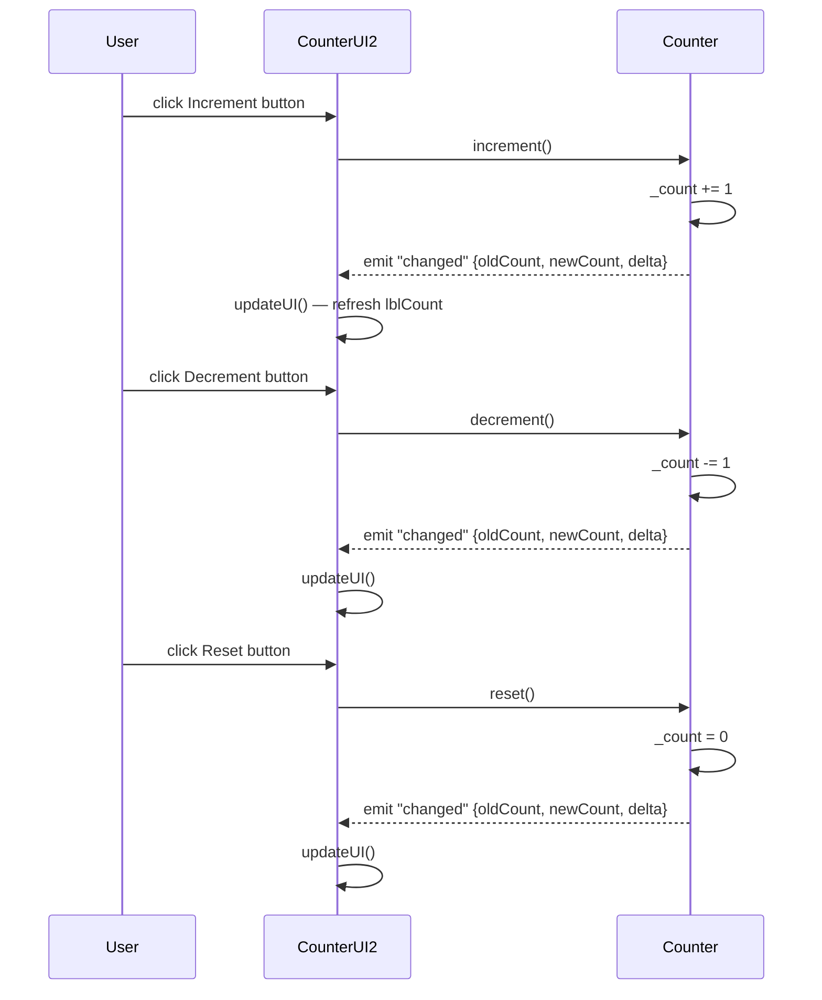
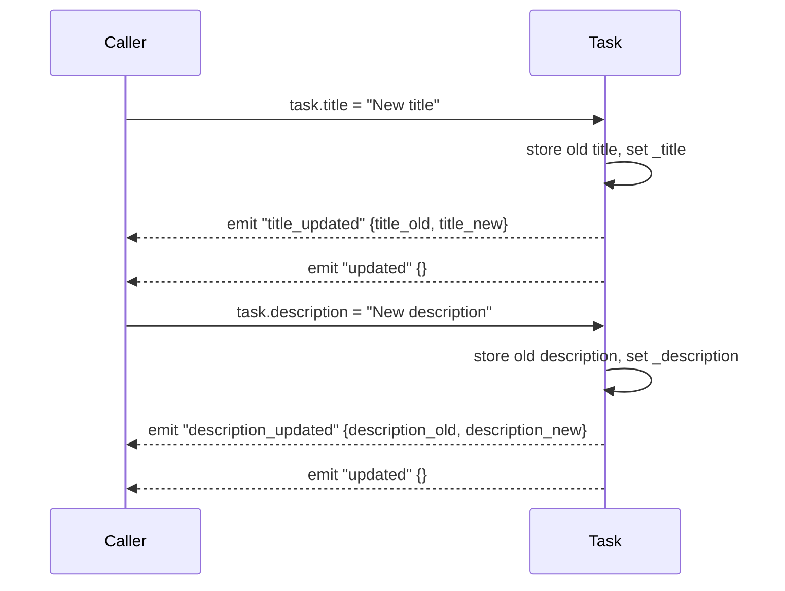
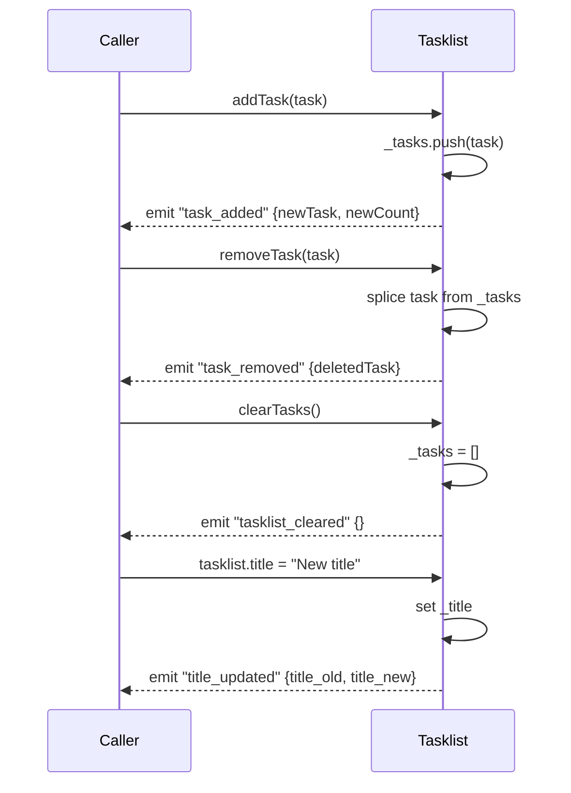

# Models

## EventEmitter (`src/baseclasses/EventHandling.ts`)

Base class for all domain models. Extends the native `EventTarget` and adds a typed `emit` helper.

```typescript
protected emit<T>(type: string, detail: T): void {
    this.dispatchEvent(new CustomEvent<T>(type, { detail }));
}
```

Listeners attach with the standard `addEventListener(eventName, handler)` API.

---

## Counter (`src/counter.ts`)

Simple integer counter with increment, decrement, and reset operations.

**Events:**

| Event constant | Value | Payload type |
|----------------|-------|--------------|
| `EVENT_CHANGED` | `'changed'` | `Counter.payloadChanged` |

**Payload — `Counter.payloadChanged`:**

| Field | Type | Description |
|-------|------|-------------|
| `oldCount` | `number` | Value before the change |
| `newCount` | `number` | Value after the change |
| `delta` | `number` | Signed difference (`newCount - oldCount`) |

**API:**

| Method / Property | Description |
|-------------------|-------------|
| `count` | Current value (read-only) |
| `increment()` | Adds 1, returns new count |
| `decrement()` | Subtracts 1, returns new count |
| `reset()` | Sets to 0, returns 0 |

**Interaction flow (CounterUI2 + Counter):**



---

## Task (`src/task.ts`)

A single task with a title and description. Both properties emit events on change.

**Events:**

| Event constant | Value | Payload type |
|----------------|-------|--------------|
| `EVENT_TITLE_UPDATED` | `'title_updated'` | `Task.event_payload_titleupdated` |
| `EVENT_DESCRIPTION_UPDATED` | `'description_updated'` | `Task.event_payload_descriptionupdated` |
| `EVENT_UPDATED` | `'updated'` | `{}` (fired on any change) |

**Payload — `Task.event_payload_titleupdated`:**

| Field | Type |
|-------|------|
| `title_old` | `string` |
| `title_new` | `string` |

**Payload — `Task.event_payload_descriptionupdated`:**

| Field | Type |
|-------|------|
| `description_old` | `string` |
| `description_new` | `string` |

**API:**

| Property | Description |
|----------|-------------|
| `title` | Get / set task title |
| `description` | Get / set task description |

**Event flow on property change:**



---

## Tasklist (`src/tasklist.ts`)

An ordered collection of `Task` objects with a title.

**Events:**

| Event constant | Value | Payload type |
|----------------|-------|--------------|
| `EVENT_TITLE_UPDATED` | `'title_updated'` | `Tasklist.event_payload_payloadTitleupdated` |
| `EVENT_TASK_ADDED` | `'task_added'` | `Tasklist.event_payload_TaskAdded` |
| `EVENT_TASK_REMOVED` | `'task_removed'` | `Tasklist.event_payload_TaskRemoved` |
| `EVENT_TASKLIST_CLEARED` | `'tasklist_cleared'` | `{}` |

**Payload — `Tasklist.event_payload_TaskAdded`:**

| Field | Type | Description |
|-------|------|-------------|
| `newTask` | `Task` | The task that was added |
| `newCount` | `number` | Total number of tasks after add |

**Payload — `Tasklist.event_payload_TaskRemoved`:**

| Field | Type |
|-------|------|
| `deletedTask` | `Task` |

**API:**

| Method / Property | Description |
|-------------------|-------------|
| `title` | Get / set list title |
| `tasks` | Read-only array of tasks |
| `addTask(task)` | Appends a task |
| `removeTask(task)` | Removes by reference |
| `clearTasks()` | Removes all tasks |

**Event flow:**


